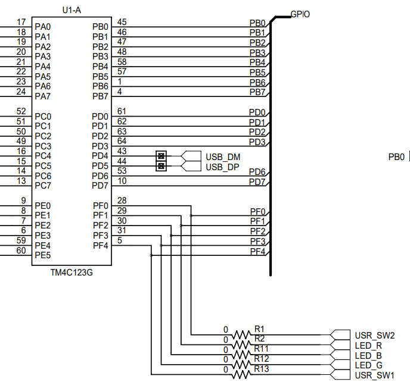

# Week 3 Exercise: Make Blinky

### Board: Texas Instruments EK-TM4C123GXL Tiva C Series LaunchPad

### Build Environment: Keil uVision4 

### Code Snippet: 

```
//***************************************************************************************
/*
Week 3 Exercise: LED Blink with Button
Joseph Kunitsky

Device: 		EK-TM4C123GXL, Tiva C Series microcontroller                 

Description: When the onboard button SW1 is pressed, the RGB LED light will turn on (GREEN LED).
		If the SW1 button is not pressed, the LED will remain off. 
*/
//***************************************************************************************

#include "tm4c123gh6pm.h"	// Header file accesses registers in TMC123 microcontroller

//define easy to read names for registers
#define GPIO_PORTF_DATA_R       (*((volatile unsigned long *)0x400253FC))
#define GPIO_PORTF_DIR_R        (*((volatile unsigned long *)0x40025400))
#define GPIO_PORTF_AFSEL_R      (*((volatile unsigned long *)0x40025420))
#define GPIO_PORTF_PUR_R        (*((volatile unsigned long *)0x40025510))
#define GPIO_PORTF_DEN_R        (*((volatile unsigned long *)0x4002551C))
#define GPIO_PORTF_LOCK_R       (*((volatile unsigned long *)0x40025520))
#define GPIO_PORTF_CR_R         (*((volatile unsigned long *)0x40025524))
#define GPIO_PORTF_AMSEL_R      (*((volatile unsigned long *)0x40025528))
#define GPIO_PORTF_PCTL_R       (*((volatile unsigned long *)0x4002552C))
#define SYSCTL_RCGC2_R          (*((volatile unsigned long *)0x400FE108))

//   Global Variables
unsigned long SW1;  	// input from PF0 and PF4

//   Function Prototypes
void PortF_Init(void);		
void Delay(void);

// 3. Subroutines Section
int main(void){    
  PortF_Init();        			// Call initialization of port PF0-PF4    
  while(1){
    SW1 = GPIO_PORTF_DATA_R&0x10; 	// read PF4 into SW1
		
    if(SW1 == 0x00){              	// 0x00 means SW1 is pressed
      GPIO_PORTF_DATA_R = 0x08;   	// LED is on and green
     } 
    else {               // 0x10 means SW1 is not pressed
      GPIO_PORTF_DATA_R = 0x00;  	// LED is off
     }

  }
}

// Subroutine to initialize port F pins for input and output
// PF4 and PF0 are input SW1 and SW2 respectively
// PF3,PF2,PF1 are outputs to the LED
void PortF_Init(void){ 
  volatile unsigned long delay;
  SYSCTL_RCGC2_R |= 0x00000020;     // 1) F clock
  delay = SYSCTL_RCGC2_R;           // reading register adds a delay   
  GPIO_PORTF_LOCK_R = 0x4C4F434B;   // 2) unlock PortF PF0  
  GPIO_PORTF_CR_R = 0x1F;           // allow changes to PF4-0       
  GPIO_PORTF_AMSEL_R = 0x00;        // 3) disable analog function
  GPIO_PORTF_PCTL_R = 0x00000000;   // 4) GPIO clear bit PCTL  
  GPIO_PORTF_DIR_R = 0x0E;          // 5) PF4,PF0 input, PF3,PF2,PF1 output   
  GPIO_PORTF_AFSEL_R = 0x00;        // 6) no alternate function
  GPIO_PORTF_PUR_R = 0x11;          // enable pullup resistors on PF4,PF0       
  GPIO_PORTF_DEN_R = 0x1F;          // 7) enable digital pins PF4-PF0        
}
```

### Hardware registers that cause LED to turn on/off:

#### pin layout


#### Register to set the GPIO data after corresponding pins have been configured as outputs through the GPIO Direction register (GPIODIR). Reads from this register also return the pins current state. 


### Watching value of button value in debug mode:
#### button pressed

#### button not pressed

